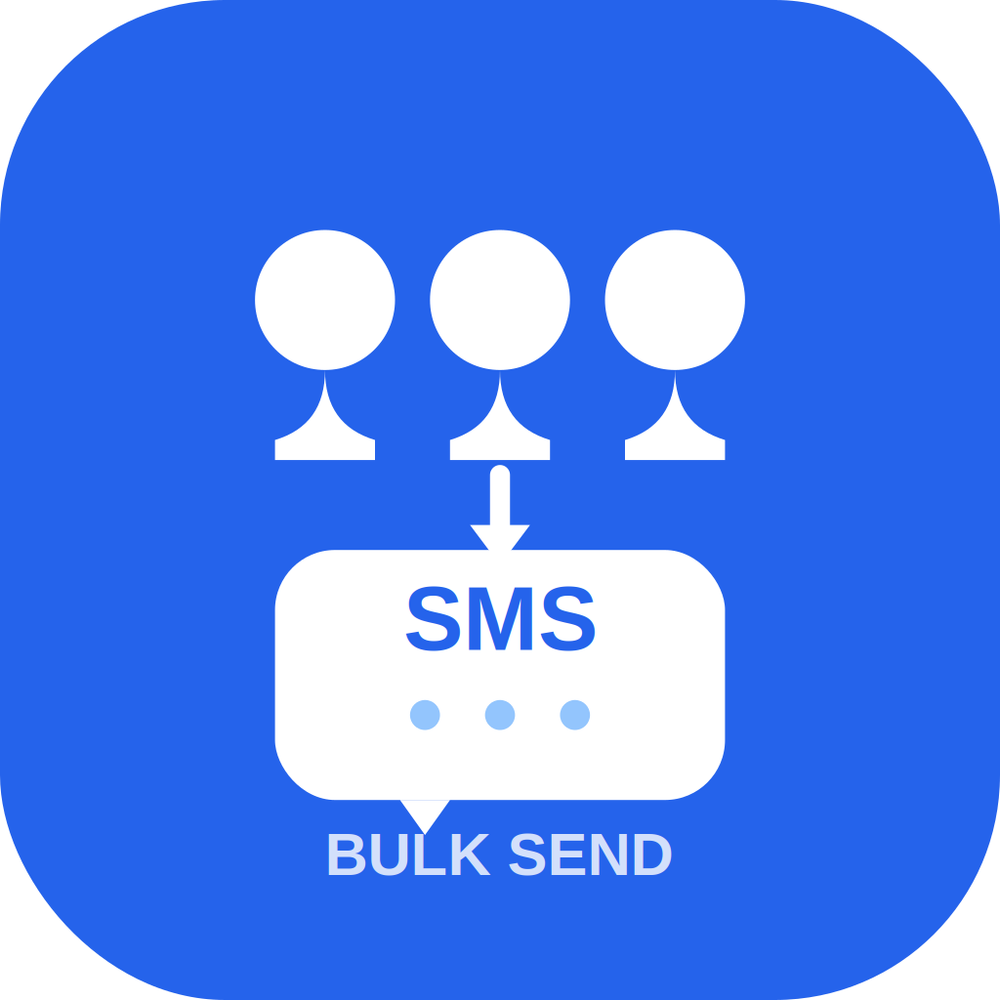

# 📱 Bulk SMS Sender

<div align="center">



**A powerful Flutter application for sending SMS messages to multiple contacts simultaneously**

[](https://flutter.dev)
[](https://dart.dev)
[](LICENSE)
[](https://github.com/flutter/flutter)

</div>

## 🌟 Overview

Bulk SMS Sender is a modern, cross-platform mobile application built with Flutter that allows users to send SMS messages to multiple contacts efficiently. Whether you need to send announcements, invitations, or notifications to a large group of people, this app streamlines the process with an intuitive interface and powerful features.

## ✨ Key Features

### 📋 **Contact Management**
- **Contact Picker**: Browse and select contacts directly from your phone's contact list
- **Bulk Number Input**: Paste multiple phone numbers at once with automatic parsing
- **Smart Detection**: Automatically detects valid phone numbers from text
- **Mixed Selection**: Combine contacts from your address book with manually entered numbers
- **Contact Filtering**: Only shows contacts with valid phone numbers

### 💬 **Message Composition**
- **Rich Text Editor**: Compose messages with character count display (160 character SMS limit)
- **Message Validation**: Real-time validation to ensure message quality
- **Preview Mode**: See exactly what your message will look like before sending

### 🚀 **Advanced SMS Sending**
- **Progress Tracking**: Real-time progress display (e.g., "25/100 sent")
- **Retry Logic**: Automatic retry for failed messages (up to 3 attempts)
- **Failed Message Handling**: Preserves failed numbers for manual retry
- **Smart Cleanup**: Only clears successful sends, keeps failed numbers for retry
- **Cross-Platform Support**: 
  - **Android**: Direct SMS sending with full automation
  - **iOS**: Opens native Messages app for manual sending

### 📱 **SIM Card Management**
- **Dual SIM Support**: Automatically detects multiple SIM cards
- **SIM Selection**: Choose which SIM card to use for sending
- **Default SIM**: Uses default messaging SIM if no selection is made

### 🎨 **Modern User Interface**
- **Material Design 3**: Beautiful, modern interface following Google's latest design guidelines
- **Dark/Light Theme**: Automatic theme switching based on system settings or manual selection
- **Theme Persistence**: Remembers your theme preference using SharedPreferences
- **Smooth Animations**: Engaging animations and transitions throughout the app
- **Responsive Design**: Works perfectly on phones and tablets

### ⚡ **State Management**
- **Riverpod**: Pure state management without setState() for optimal performance
- **Reactive UI**: Automatic UI updates when data changes
- **Efficient Memory Usage**: Smart state management prevents memory leaks

## 🏗️ Architecture

### **State Management Pattern**
```
├── Providers (Riverpod)
│   ├── ThemeProvider - Theme management
│   ├── ContactsProvider - Contact data handling
│   ├── MessageProvider - Message composition
│   ├── SmsStateProvider - SMS sending progress
│   └── PermissionProvider - Permission management
```

### **UI Architecture**
```
├── Screens
│   ├── HomeScreen - Main SMS composition and sending
│   └── SettingsScreen - App settings and information
├── Widgets
│   ├── ContactListWidget - Contact selection interface
│   ├── NumberInputWidget - Manual number entry
│   └── SmsProgressWidget - Sending progress display
└── Services
    └── PermissionService - Handle all app permissions
```

## 📱 Screenshots

### Main Interface
- **Contact Selection**: Easy-to-use interface for selecting recipients
- **Message Composition**: Clean text input with character counting
- **Progress Tracking**: Real-time sending progress with visual feedback

### Settings Screen
- **Theme Selection**: Light/Dark/Auto theme options
- **App Information**: Version details and developer information
- **Privacy Information**: Clear explanation of required permissions

## 🚀 Getting Started

### Prerequisites
- Flutter SDK 3.8.1 or higher
- Dart SDK 3.0 or higher
- Android Studio / Xcode for device testing
- Physical device (recommended for SMS testing)

### Installation

1. **Clone the repository**
   ```bash
   git clone https://github.com/yourusername/bulk-sms-sender.git
   cd bulk-sms-sender
   ```

2. **Install dependencies**
   ```bash
   flutter pub get
   ```

3. **Generate app icons**
   ```bash
   flutter pub run flutter_launcher_icons
   ```

4. **Run the app**
   ```bash
   flutter run
   ```

### Building for Production

**Android APK**
```bash
flutter build apk --release
```

**iOS App**
```bash
flutter build ios --release
```

## 🔐 Permissions

The app requires the following permissions to function properly:

### Android
- `READ_CONTACTS` - Access device contacts
- `SEND_SMS` - Send SMS messages
- `READ_PHONE_STATE` - Access phone information for dual SIM
- `INTERNET` - For app updates and package info
- `VIBRATE` - Notification feedback

### iOS
- `NSContactsUsageDescription` - Access contacts for recipient selection

The app includes a comprehensive permission management system that:
- Explains why each permission is needed
- Provides easy access to system settings
- Handles permission denials gracefully

## 📋 Usage Guide

### 1. **First Launch**
- Grant necessary permissions (Contacts, SMS, Phone)
- The app will guide you through the setup process

### 2. **Composing a Message**
- Type your message in the text field
- Monitor character count (SMS limit: 160 characters)
- Message validates in real-time

### 3. **Adding Recipients**
**From Contacts:**
- Browse your contact list
- Select individual contacts or use "Select All"
- Only contacts with phone numbers are shown

**Manual Entry:**
- Paste phone numbers in the text field
- Supports multiple formats: +1234567890, (123) 456-7890, etc.
- Automatically detects and parses valid numbers
- Add/remove individual numbers as needed

### 4. **Sending Messages**
- Review recipient count and message
- Select SIM card (if dual SIM device)
- Tap "Send SMS" to begin
- Monitor real-time progress
- Failed messages are automatically retried

### 5. **Handling Failures**
- Failed numbers remain in the list for retry
- Successful numbers are automatically removed
- Manual retry option available for failed messages

## 🛠️ Technical Details

### **Dependencies**
- **flutter_riverpod**: State management
- **contacts_service**: Contact access
- **flutter_sms**: SMS functionality  
- **permission_handler**: Permission management
- **telephony**: Android SMS API
- **shared_preferences**: Settings storage
- **package_info_plus**: App information
- **animated_text_kit**: UI animations

### **Platform Support**
| Feature | Android | iOS |
|---------|---------|-----|
| Contact Selection | ✅ Full Support | ✅ Full Support |
| SMS Sending | ✅ Direct Send | ⚠️ Via Messages App |
| Dual SIM | ✅ Supported | ❌ Not Available |
| Background Sending | ✅ Supported | ❌ Not Available |
| Delivery Reports | ✅ Available | ❌ Not Available |

### **Performance Features**
- Lazy loading of large contact lists
- Efficient memory management with Riverpod
- Background SMS sending (Android)
- Smart retry logic with exponential backoff
- Optimized UI rendering for smooth scrolling

## 🔧 Configuration

### **Customizing Theme Colors**
Edit the theme colors in `lib/main.dart`:
```dart
colorScheme: ColorScheme.fromSeed(
  seedColor: Colors.blue, // Change this color
  brightness: Brightness.light,
),
```

### **Adjusting SMS Settings**
Modify SMS behavior in `lib/screens/home_screen.dart`:
```dart
const maxRetries = 3; // Change retry count
const retryDelay = Duration(seconds: 1); // Change retry delay
```

## 🤝 Contributing

We welcome contributions! Please follow these steps:

1. Fork the repository
2. Create a feature branch (`git checkout -b feature/AmazingFeature`)
3. Commit your changes (`git commit -m 'Add some AmazingFeature'`)
4. Push to the branch (`git push origin feature/AmazingFeature`)
5. Open a Pull Request

### **Development Guidelines**
- Follow Dart/Flutter style guidelines
- Use Riverpod for state management (no setState)
- Add comments for complex logic
- Test on both Android and iOS
- Update README if adding new features

## 📄 License

This project is licensed under the MIT License - see the [LICENSE](LICENSE) file for details.

## 🙏 Acknowledgments

- Flutter team for the amazing framework
- Riverpod community for excellent state management
- Material Design team for beautiful UI guidelines
- Open source contributors for various packages used

## 📞 Support

If you encounter any issues or have questions:

1. Check the [Issues](https://github.com/yourusername/bulk-sms-sender/issues) page
2. Create a new issue with detailed information
3. Include device information and steps to reproduce

## 🚧 Roadmap

### Upcoming Features
- [ ] Message templates and quick responses
- [ ] Contact groups and categories  
- [ ] Message scheduling for future sending
- [ ] Delivery status tracking (Android)
- [ ] Export/import contact lists
- [ ] Multi-language support
- [ ] Message history and analytics

### Known Limitations
- iOS requires manual sending through Messages app
- SMS character limit varies by carrier
- Some carriers may have rate limiting
- Dual SIM detection limited on some devices

---

<div align="center">

**Built with ❤️ using Flutter**

[Report Bug](https://github.com/yourusername/bulk-sms-sender/issues) · [Request Feature](https://github.com/yourusername/bulk-sms-sender/issues) · [Documentation](https://github.com/yourusername/bulk-sms-sender/wiki)

</div>